# Установка IntelliJ IDEA

**Важно**: если у вас что-то не получилось, то оформляйте Issue [по установленным правилам](../report-requirements.md).

Шаг 1. Перейдите по адресу https://www.jetbrains.com/toolbox/app/, выберите необходиму ОС и нажмите кнопку "Скачать":

Шаг 2. Запустите скачанный файл и нажмите кнопку "Установить":

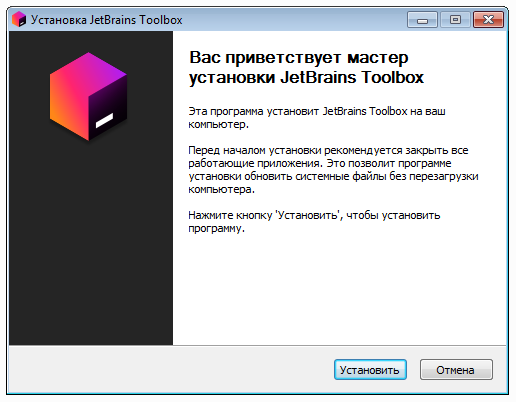

Шаг 3. Дождитесь завершения установки и нажмите кнопку "Готово" (флажок "Запустить JetBrains Toolbox" должен быть выставлен):

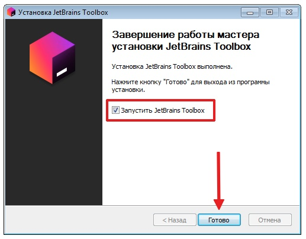

Шаг 4. Иконка Toolbox появится в системном трее, кликните на ней левой кнопкой мыши:

Шаг 5. Прочитайте лицензионное соглашение и нажмите кнопку "Accept":

Шаг 6. Нажмите "Install" для "IntelliJ IDEA Community":

Шаг 7. Дождитесь завершения установки и нажмите на кнопку запуска "IntelliJ IDEA Community":

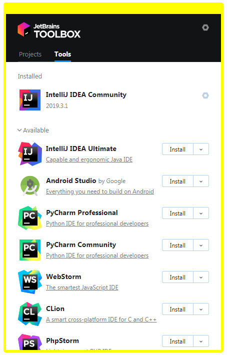

Шаг 8. Если вы до этого не пользовались IntelliJ IDEA (и у вас нет сохранённых настроек) выберите опцию "Do not import settings", затем кнопку "OK":

Шаг 9. Согласитесь с "Privacy Policy" и нажмите кнопку "Continue":

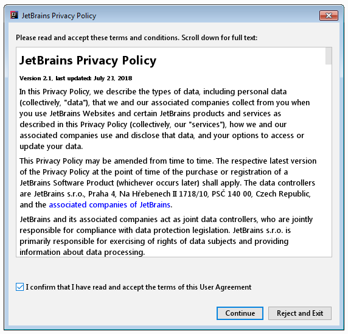

Шаг 10. При желании вы можете отправлять данные об использовании IntelliJ IDEA в компанию IDEA (выберите любую из опций: "Send ..." - отправлять, "Don't send" - не отправлять):

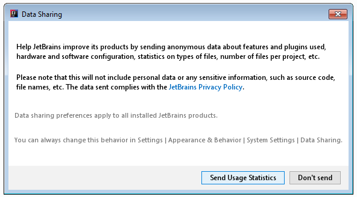

Шаг 11. Выберите по своим предпочтениям тему оформления (тёмную "Darcula" или светлую "Light") и нажмите на кнопку "Skip Remaining and Set Defaults":

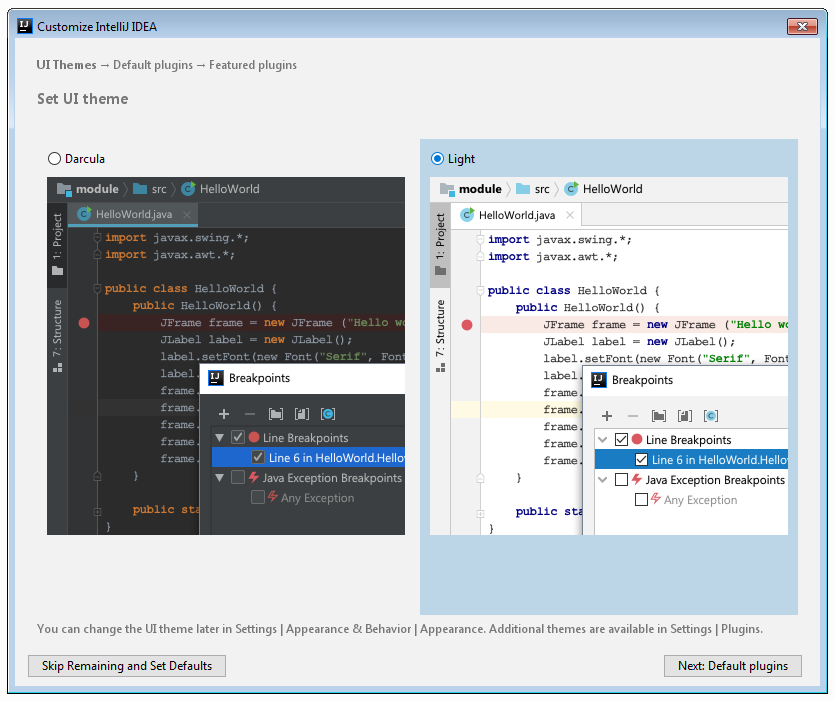

Шаг 12. Дождитесь появления стартового окна и выберите "Create New Project":

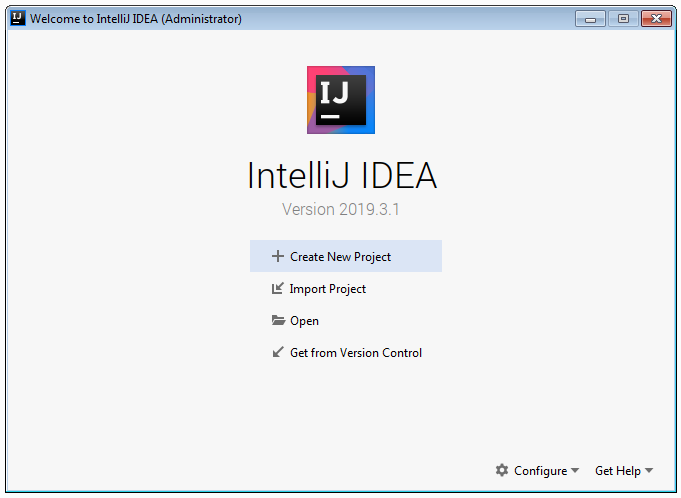

Шаг 13. Удостоверьтесь, что при выборе "Java" в списке есть "11 (java version "11.x.x")" и нажмите на кнопку "Next":

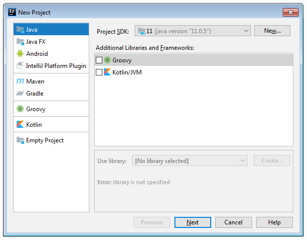

Шаг 14. Нажмите "Next":

Шаг 15. Оставьте значение полей по умолчанию, предварительно убедившись, что в пути к проекту нет никаких кириллических символов или пробелов (если же они там есть - измените путь с помощью кнопки `...`, например, на `C:/Projects/untitled`) и нажмите "Finish":

Шаг 16. Чтобы не получать при каждом запуске подсказок по использованию IntelliJ IDEA, снимите флажок "Show tips on startup" и нажмите кнопку "Close": 

Шаг 17. При первом запуске IntelliJ IDEA понадобится какое-то время, чтобы проиндексировать вашу установку JDK, подождите, пока все процессы завершатся:

Шаг 18. В панельке проекта (`Alt + 1`) раскройте структуру каталогов и на каталоге `src` щёлкните правой кнопкой мыши и выберите "New" -> "Java Class":

Шаг 19: В открывшемся окне введите `Main` и нажмите клавишу "Enter":

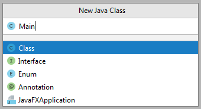

Шаг 19: Замените содержимое открывшегося файла [кодом с лекции](https://github.com/netology-code/javaqa-code/blob/master/intro/Main.java), чтобы текущее состояние соответствовало тому, что вы видите на экране:

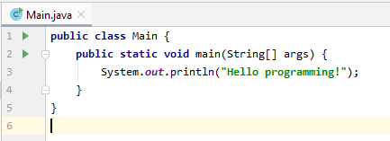

Шаг 20: Нажмите на зелёную стрелку на первой строке, выберите "Run 'Main.main()'":

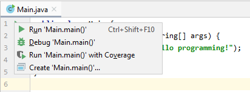

Шаг 21: Удостоверьтесь, что вывод программы соответствует скриншоту:

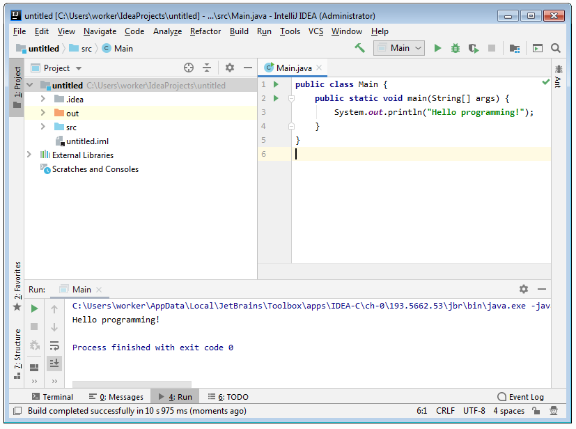

Поздравляем! Вы успешно установили IntelliJ IDEA и запустили первое Java-приложение.

